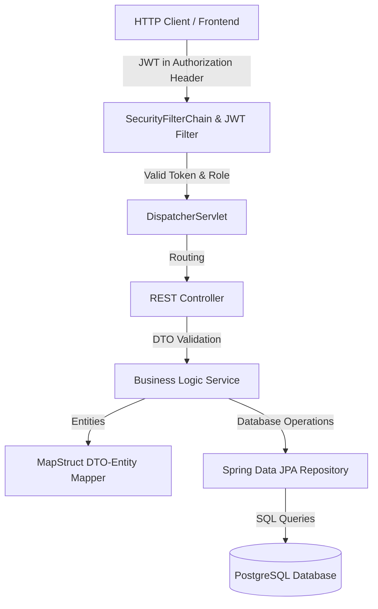
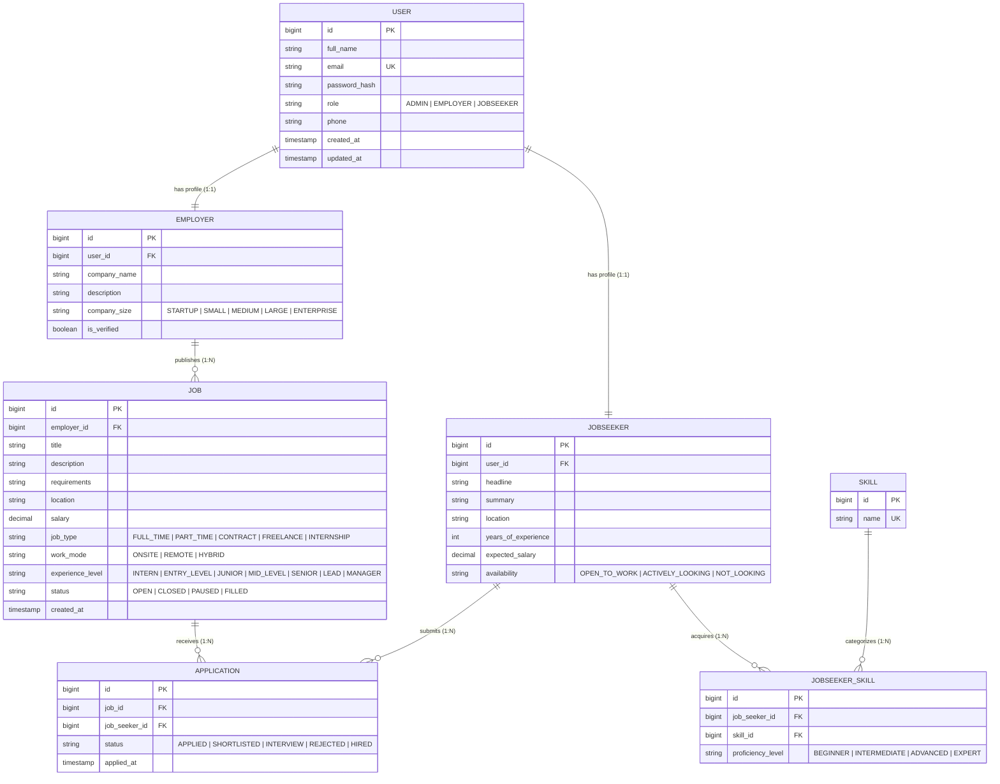

# 💼 Job Portal Backend REST API

[](https://openjdk.org)
[](https://spring.io/projects/spring-boot)
[](https://www.postgresql.org)
[](https://github.com/jwtk/jjwt)
[](https://maven.apache.org)
[](https://www.docker.com)
[](https://railway.app)

An enterprise-grade, fully-featured **Job Portal REST API** engineered with **Spring Boot 3.5**, **Spring Security**, and stateless **JWT Authentication**. It supports a role-based workflow for three distinct user types — **Admin**, **Employer**, and **Job Seeker** — and manages complex processes like job publishing, dynamic searching, multi-status application pipelines, and skill matrices.

---

## 📖 Table of Contents
1. [Key Architecture & Data Flows](#-key-architecture--data-flows)
2. [Tech Stack](#-tech-stack)
3. [Project Directory Structure](#-project-directory-structure)
4. [Authentication & Authorization](#-authentication--authorization)
5. [Database Entities & Schema Design](#-database-entities--schema-design)
6. [Dynamic Job Filtering](#-dynamic-job-filtering)
7. [Auto-Seeding & Dummy Data](#-auto-seeding--dummy-data)
8. [Configuration & Environment Variables](#-configuration--environment-variables)
9. [Local Development Guide](#-local-development-guide)
10. [Docker Containerization Guide](#-docker-containerization-guide)
11. [API Documentation (OpenAPI / Swagger)](#-api-documentation-openapi--swagger)
12. [Security Architecture](#-security-architecture)
13. [Monitoring & Health Metrics](#-monitoring--health-metrics)
14. [License](#-license)

---

## 🗺️ Key Architecture & Data Flows

The backend adheres to a clean layered architecture, separation of concerns, and stateless design.

### Request Execution Flow


---

## 🚀 Tech Stack

| Layer / Aspect | Technology | Version | Description |
|---|---|---|---|
| **Language** | Java | 21 | OpenJDK 21 LTS (Eclipse Temurin distribution) |
| **Framework** | Spring Boot | 3.5.12 | Core MVC framework, DI container, application starter |
| **Security** | Spring Security | 3.5.x | Role-based request interceptors, method security (`@PreAuthorize`) |
| **Tokens** | JJWT (Java JWT) | 0.12.5 | Cryptographic JWT creation, verification, and claims retrieval |
| **Database** | PostgreSQL | 16+ | Enterprise relational database for transactional storage |
| **ORM / JPA** | Spring Data JPA | 3.5.x | Interface-driven repositories, Hibernate implementation, Dynamic Specifications |
| **DTO Mapping** | MapStruct | 1.5.5.Final | Compile-time mapper for high-performance Entity-to-DTO conversion |
| **API Docs** | SpringDoc OpenAPI | 2.8.15 | Auto-generates Swagger-compliant JSON specs and interactive UI |
| **Boilerplate** | Project Lombok | 1.18.x | Code generation for getters, setters, builders, and constructors |
| **Monitoring** | Spring Boot Actuator| 3.5.x | Operational metrics, application health checks, info endpoints |
| **Containerization**| Docker & Compose | 3.8 | Builds and runs reproducible isolated runtime environments |

---

## 📁 Project Directory Structure

```
src/main/java/com/saurabh/
├── configuration/          # Infrastructure configurations
│   ├── JWTAuthenticationFilter.java     # Extracts JWT token and validates signature
│   ├── SecurityFilterChainConfig.java   # Defines CORS, endpoint roles, and entry points
│   ├── AuthenticationConfig.java        # Exposes authentication manager, provider, & encoder
│   └── SwaggerConfig.java               # Configures OpenAPI specifications & security schemes
├── Controller/             # REST endpoints (controllers)
│   ├── AuthController.java              # Sign-up and login routes
│   ├── UserController.java              # Common user profile management
│   ├── AdminController.java             # Administrative tasks (user management, verification)
│   ├── EmployerController.java          # Company configuration, posted jobs, applicants
│   ├── JobController.java               # Public browsing, filtering, and job posts
│   ├── JobSeekerController.java         # Resume & skill portfolios for candidates
│   ├── ApplicationController.java       # Job application workflow (apply, withdraw, accept/reject)
│   └── SkillController.java             # Directory of available skills
├── service/                # Business logic and transaction management
├── repository/             # Data access abstraction layer (Spring Data JPA)
├── Entity/                 # Relational database models (JPA Entities)
├── DTOs/                   # Request/Response Data Transfer Objects (Records & Classes)
├── ENUMS/                  # Type-safe constants (Roles, JobTypes, Statuses, Levels)
├── Specification/          # Dynamic queries logic (JPA Criteria API)
├── mapper/                 # MapStruct interface definitions
├── exception/              # Domain-specific custom exceptions & global error handlers
├── util/                   # Internal utilities (JWT secret parsing, token helpers)
├── AdminInitializer.java   # Bootstrap loader to verify and seed default admin user
├── DataSeeder.java         # Populates database with dummy job seekers/employers for testing
└── myapp.java              # Main executable entrypoint class
```

---

## 🔐 Authentication & Authorization

Authentication is completely **stateless**. During login, the server returns a signed JWT. Clients must cache this token and supply it in the `Authorization` header of subsequent requests:

```http
Authorization: Bearer <your_jwt_token>
```

### Roles and Scope Matrix

| Role | Allowed API Actions | Seeded Demo Accounts |
|---|---|---|
| 👑 **ADMIN** | System-wide audit, view pagination of all users, delete/ban any user account, verify company/employer legitimacy. | `admin@gmail.com` (pw: `admin123`) |
| 🏢 **EMPLOYER** | Create jobs, update job status (`OPEN`, `CLOSED`, etc.), view and modify statuses of incoming applications, edit company profile. | `employer1@gmail.com` to `employer50@gmail.com` (pw: `password123`) |
| 💼 **JOBSEEKER** | View listings, search and filter jobs, apply for vacancies, withdraw applications, update resume, manage personal skills registry. | `jobseeker1@gmail.com` to `jobseeker50@gmail.com` (pw: `password123`) |

---

## 🗃️ Database Entities & Schema Design

The JPA-managed PostgreSQL database schema models relationships among users, profiles, jobs, application states, and skills.



---

## 📡 API Endpoints

### 🔓 Authentication Endpoints (`/api/v1/auth`)
*No credentials needed.*

| Method | Route | Payload Body (JSON) | Response (JSON) |
|---|---|---|---|
| `POST` | `/api/v1/auth/sign-up` | Signup parameters (`fname`, `email`, `password`, `phone`, `role`) | Account details and generated JWT token |
| `POST` | `/api/v1/auth/login` | Login parameters (`email`, `password`) | Valid JWT token & auth status metadata |

---

### 💼 Job Postings & Public Browsing (`/api/v1/jobs`)
*Dynamic sorting, filtering, and pagination.*

| Method | Route | Authorization | Description |
|---|---|---|---|
| `GET` | `/api/v1/jobs` | Public | Search listings with query parameters (`page`, `size`, `title`, `location`, `jobType`, `workMode`, `status`). |
| `GET` | `/api/v1/jobs/{id}` | Public | Fetch specific job details by ID. |
| `POST` | `/api/v1/jobs` | **EMPLOYER** | Publish a new job vacancy. |
| `PUT` | `/api/v1/jobs/{id}` | **EMPLOYER (Owner)** | Update details of an existing job posting. |
| `DELETE` | `/api/v1/jobs/{id}` | **EMPLOYER (Owner)** | Remove a job posting. |
| `PATCH` | `/api/v1/jobs/{id}/status`| **EMPLOYER (Owner)** | Transition job state (e.g., set status to `CLOSED` or `FILLED`). |

---

### 👤 Job Seeker Portal (`/api/v1/jobseekers`)
*Candidate portfolios, profiles, and skills.*

| Method | Route | Authorization | Description |
|---|---|---|---|
| `GET` | `/api/v1/jobseekers/me` | **JOBSEEKER** | Retrieve current candidate profile. |
| `PUT` | `/api/v1/jobseekers/me` | **JOBSEEKER** | Modify resume fields, headline, location, and salary expectations. |
| `GET` | `/api/v1/jobseekers/me/skills` | **JOBSEEKER** | Fetch list of user-defined skills and proficiency levels. |
| `POST` | `/api/v1/jobseekers/me/skills` | **JOBSEEKER** | Link a skill to profile (`?request=Java`). |
| `DELETE` | `/api/v1/jobseekers/me/skills/{skillId}`| **JOBSEEKER** | Remove a skill association. |

---

### 🏢 Employer Management (`/api/v1/employer`)
*Recruitment tools.*

| Method | Route | Authorization | Description |
|---|---|---|---|
| `GET` | `/api/v1/employer/me` | **EMPLOYER** | View logged-in company details. |
| `PUT` | `/api/v1/employer/me` | **EMPLOYER** | Update corporate details and company size. |
| `GET` | `/api/v1/employer/jobs` | **EMPLOYER** | Retrieve all job listings posted by the logged-in company. |
| `GET` | `/api/v1/employer/jobs/{jobId}/applications` | **EMPLOYER** | Get all applications for a specific job posting. |
| `GET` | `/api/v1/employer/all-applications` | **EMPLOYER** | Get all applications across all jobs posted by the employer. |

---

### 📋 Application Pipeline (`/api/v1/applications`)
*Application status transitions.*

| Method | Route | Authorization | Description |
|---|---|---|---|
| `POST` | `/api/v1/applications/{jobId}/apply` | **JOBSEEKER** | Submit application for a vacancy. |
| `GET` | `/api/v1/applications/my` | **JOBSEEKER** | View tracking history of submitted applications. |
| `DELETE` | `/api/v1/applications/{id}` | **JOBSEEKER** | Withdraw application. |
| `PATCH` | `/api/v1/applications/{id}/status` | **EMPLOYER** | Advance status: `APPLIED`, `SHORTLISTED`, `INTERVIEW`, `REJECTED`, or `HIRED`. |

---

### 🛠️ Admin Control Panel (`/api/v1/admin`)
*System audits.*

| Method | Route | Authorization | Description |
|---|---|---|---|
| `GET` | `/api/v1/admin/users` | **ADMIN** | Fetch paginated overview of all registered users. |
| `DELETE` | `/api/v1/admin/users/{email}`| **ADMIN** | Purge a user by email address. |
| `POST` | `/api/v1/admin/employers/{id}/verify`| **ADMIN** | Set an employer's `is_verified` flag to `true` (renders verified badges). |

---

## 🔍 Dynamic Job Filtering

The endpoint `GET /api/v1/jobs` implements advanced querying using Spring Data JPA's `Specification` API. Under the hood, this converts parameters dynamically into structured SQL WHERE clauses using the JPA Criteria API.

For example, a query like:
```http
GET /api/v1/jobs?title=developer&location=Delhi&jobType=FULL_TIME&workMode=HYBRID
```
constructs an efficient SQL statement matching all query criteria, allowing scalable client-side filtering.

---

## 🌱 Auto-Seeding & Dummy Data

To facilitate testing immediately after launch, two bootstrap scripts execute automatically when the DB connection is established:

1. **Admin Account Setup (`AdminInitializer`)**: Checks for `admin@gmail.com` and creates it if not found:
   - **Email**: `admin@gmail.com`
   - **Password**: `admin123`
2. **Bulk Demo Seeding (`DataSeeder`)**: Seeds 50 Employers and 50 Job Seekers to populate feed lists:
   - Job Seekers: `jobseeker1@gmail.com` to `jobseeker50@gmail.com` (Password: `password123`)
   - Employers: `employer1@gmail.com` to `employer50@gmail.com` (Password: `password123`)

---

## ⚙️ Configuration & Environment Variables

This application supports automatic `.env` imports directly into `application.properties` on startup:
```properties
spring.config.import=optional:file:.env[.properties]
```

Create a `.env` file in the root directory before running the system:

| Variable | Description | Example Value |
|---|---|---|
| `DB_URL` | JDBC Connection URL to PostgreSQL instance | `jdbc:postgresql://localhost:5432/jobportal` |
| `DB_USERNAME` | Master user for database auth | `postgres` |
| `DB_PASSWORD` | Database credentials | `rootpassword` |
| `JWT_SECRET` | Secret key for signing HMAC-SHA hashes (minimum 256-bit) | `your_very_long_secret_key_at_least_32_characters` |
| `JWT_EXPIRATION` | Token time-to-live **in milliseconds** | `86400000` (equal to 24 hours) |
| `PORT` | Active API port on which local server runs | `8080` |

> [!WARNING]
> Ensure that `JWT_EXPIRATION` is defined in **milliseconds** (e.g. `86400000` for 24h). Setting it to a low value like `60` expecting minutes will invalidate all credentials after 60 milliseconds!

---

## 🏃 Local Development Guide

### Prerequisites
- **Java SE Development Kit (JDK) 21** or higher.
- **Apache Maven 3.9+**.
- **PostgreSQL 16** server running locally.

### Step-by-Step Setup

1. **Clone the project repository:**
   ```bash
   git clone <repository-url>
   cd job-portal-backend
   ```

2. **Configure environment variables:**
   Create a `.env` file in the project root matching the schema described in the [Environment Variables](#-configuration--environment-variables) section.

3. **Initialize the local database:**
   Ensure PostgreSQL is running and create the target database matching the `DB_URL` value (e.g., `jobportal`).
   ```sql
   CREATE DATABASE jobportal;
   ```

4. **Compile and build executable package:**
   ```bash
   mvn clean package -DskipTests
   ```

5. **Start the application server:**
   ```bash
   java -jar target/job-portal-backend-0.0.1-SNAPSHOT.jar
   ```
   The backend will bootstrap and start serving traffic at `http://localhost:8080`.

---

## 🐳 Docker Containerization Guide

### Container Design & Ports
The project includes a multi-stage `Dockerfile`:
- **Build Stage**: Leverages Maven 3.9.6 & Eclipse Temurin 21 to build the jar.
- **Run Stage**: Uses an ultra-lightweight eclipse-temurin JRE-alpine image exposing port `7860`.

### Running with Docker Compose

1. Compile the app and launch container stack using the local environment definition:
   ```bash
   docker-compose up --build
   ```

2. The application container is configured to launch inside Docker and expose the internal server's listening port `7860` out to the host system port `8080`. Thus, you can access the REST API externally on:
   ```
   http://localhost:8080
   ```

---

## 📖 API Documentation (OpenAPI / Swagger)

Once the Spring Boot server has initialized, the Swagger interactive OpenAPI playground is available for manual endpoint testing:

- **Local Swagger UI Playground**: [http://localhost:8080/swagger-ui/index.html](http://localhost:8080/swagger-ui/index.html)
- **Live Deployed API Playground**: [https://job-portal-backend-production-1bc7.up.railway.app/swagger-ui/index.html](https://job-portal-backend-production-1bc7.up.railway.app/swagger-ui/index.html)

> [!TIP]
> **Testing Authorized Routes in Swagger**:
> 1. Call `POST /api/v1/auth/login` to retrieve a token.
> 2. Click the green **Authorize** button at the top of the Swagger web console.
> 3. Paste the raw JWT token value into the value field and click **Authorize**. All protected controllers will automatically pass authentication verification!

---

## 🛡️ Security Architecture

- **Stateless Session Filter**: No HTTP session values are kept on the server memory. Every endpoint call parses and decrypts JWT token signatures on-the-fly (`JWTAuthenticationFilter`).
- **Method-Level Security**: Crucial endpoints use Java Annotation decorators (e.g. `@PreAuthorize("hasRole('EMPLOYER')")`) to prevent unauthorized escalation.
- **Data Owner Checks**: Strict service logic rules check user ownership attributes (e.g., an Employer can only manage jobs they posted; Job Seekers can only delete their own submissions).
- **Strong Cryptography**: Uses the standard BCrypt password hashing implementation with a strength factor of 10 for encoding raw database password entries.
- **CORS Config**: Rejects requests originating from untrusted web locations, with whitelisted pathways for development targets (`http://localhost:5173`) and the production site client.

---

## 📈 Monitoring & Health Metrics

The backend exposes system metrics using **Spring Boot Actuator**.

- **Health Status Check**: [http://localhost:8080/actuator/health](http://localhost:8080/actuator/health)
  Returns JVM thread summaries, database connectivity tests, and disc-space checks.
  ```json
  {
    "status": "UP"
  }
  ```
- **Operational Metrics**: Access generic statistics and memory consumption charts via `/actuator/metrics` routes.

---

## 👨‍💻 Author

- **Saurabh Kawatra** — Lead Backend developer.

---

## 📄 License

This software is developed and distributed under the terms of the **MIT License**. For details, check the licensing specifications.
